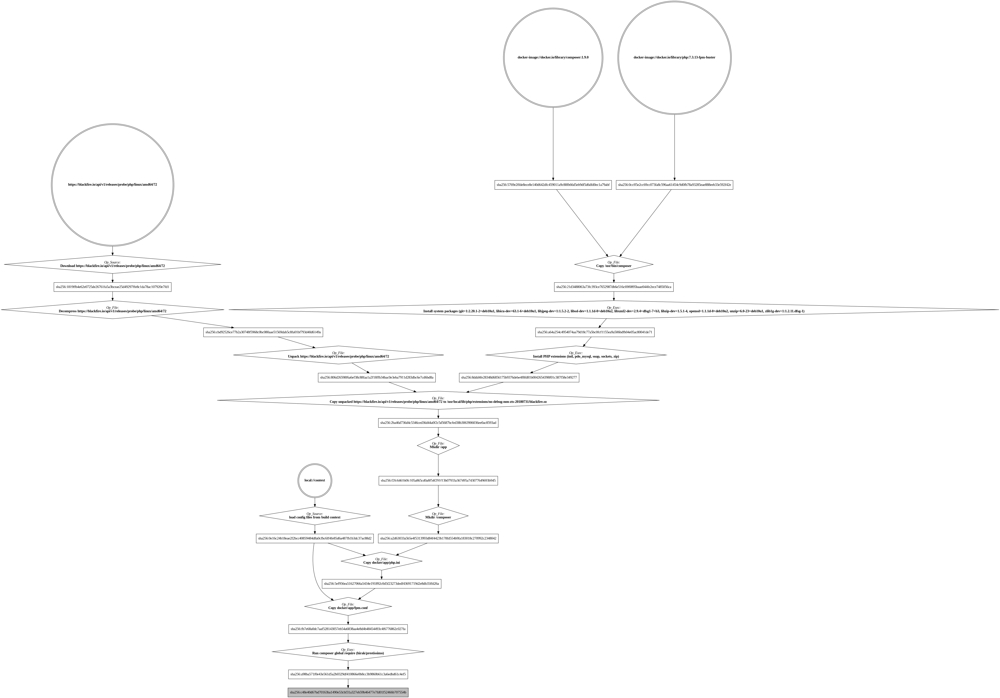
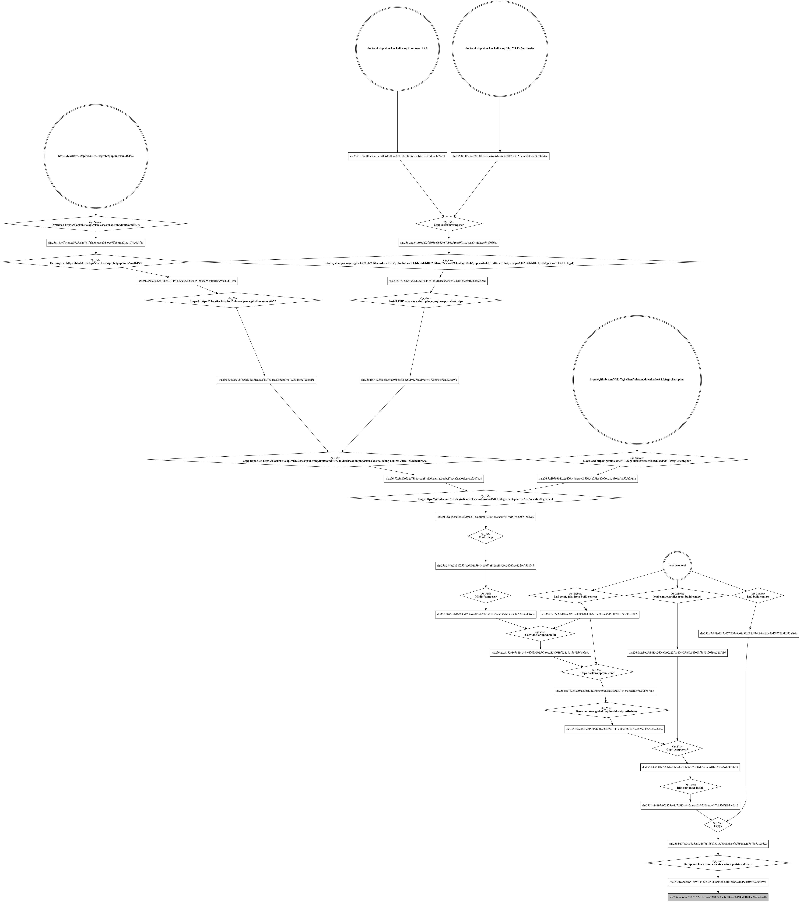

# PHP definitions

* [Multi-stages and dev builds](#multi-stages-and-dev-builds)
* [Config inference](#config-inference)
* [Build process](#build-process)
* [Locking](#locking)
* [Assets and webserver](#assets-and-webserver)
* [Custom base images](#custom-base-images)
* [Syntax](#syntax)
  * [Source context - `<source_context>`](#source-context--source-context)
  * [Derived stage - `<derived_stage>`](#derived-stage---derived_stage)
  * [Stage - `<stage>`](#stage---stage)
  * [External files - `<external_files>`](#external-files---external_files)
  * [System packages - `<system_packages>`](#system-packages---system_packages)
  * [Extensions - `<extensions>`](#extensions---extensions)
  * [Global deps - `<global_deps>`](#global-deps---global_deps)
  * [Config files - `<config_files>`](#config-files---config_files)
  * [`composer dump` flags - `<composer_dump>`](#composer-dump-flags---composer_dump)
  * [Sources - `<sources>`](#sources---sources)
  * [Integrations - `<integrations>`](#integrations---integrations)
  * [Stateful dirs - `<stateful_dirs>`](#stateful-dirs---stateful_dirs)
  * [Post install steps - `<post_install>`](#post-install-steps---post_install)
  * [Healthcheck - `<healthcheck>](#healthcheck---healthcheck)
* [Full example](#full-example)

A [full example](#full-example) is available at the end of this page, but you
can also take a look at following examples:

* [`symfony/demo`](/examples/symfony-demo/zbuild.yml)
* [`api-platform/demo`](/examples/api-platform-demo/api/zbuild.yml)
* [`laravel-backpack/demo`](/examples/laravel-backpack-demo/zbuild.yml)

## Multi-stages and dev builds

Using Docker for dev and prod purpose is not exactly the same thing. In the
first case, you probably want some development tools, an unoptimized PHP
autoloader, bind-mounts between your container and local sources etc... Whereas
for your prod environment, you probably want an optimized autoloader, no
bind-mounts, etc...

Moreover, if you're used to use docker and write Dockerfiles to build complex
PHP project, you probably have used the multi-stage feature to build the FPM
server along with some workers or webserver, all from a single `Dockerfile`.

zbuild helps you there:

1. it supports multi-stage workflows, so you can easily create a base config
and derive it to make specialized stages. When the build process kicks off, 
the final build config is resolved by merging each stage with its parent, until
the `base` stage ;

2. you can also mark stages as dev. This will build lighter images that include
only what's needed to start a container with bind-mounts (no composer install,
no autoload dump, no post install steps, etc...) ;

As an example, here're two visual representations of the build steps executed
by zbuild. The first example has been generated from a `dev` stage:



An this one has been generated from a non-dev stage (these come from zbuild 
test suite):



## Config inference

When inference is enabled, zbuild automatically:

* Add `apcu` and `opcache` extensions for non-dev stages, when FPM mode is
enabled ;
* Add extensions requirements from your `composer.json` and `composer.lock`
files ;
* Add `zip` extension (as it's required by composer) ;
* Add `unzip` and `git` system packages ;
* Add known system packages requirements for extensions to install ;

zbuild knowns the system packages required by following extensions:

* bz2
* enchant
* ffi
* ftp
* gd
* gmp
* imap
* intl
* ldap
* mcrypt
* oci8
* odbc
* pdo_dblib
* pdo_firebird
* pdo_oci
* pdo_odbc
* pdo_pgsql
* pdo_sqlite
* pgsq
* phar
* pspell
* readline
* recode
* simplexml
* snmp
* soap
* sodium
* sockets
* tidy
* wddx
* xml
* xmlreader
* xmlrpc
* xmlwriter
* xsl
* zip
* imagick
* redis
* memcache
* memcached
* mongodb
* amqp
* couchbase
* rdkafka
* zookeeper

## Build process

The image build process for the php kinds have the following steps:

* Install system packages ;
* Install PHP extensions ;
* Copy external files ;
* Create `/app` and `/composer` paths ;
* At this point, the build process switch to user `1000` ;
* Copy config files ;
* Install global dependencies ;

Moreover, when the target stage is non-dev, following steps also happen:

* Install project dependencies ;
* Copy sources files ;
* Execute post install steps ;

Also note that uid 1000 is automatically set as the default user.

## Locking

When using `zbuild update` to create or update your lockfile, the base image
digest is resolved and for each stage, extensions and system packages are
pinned to a specific version.

For the base image, zbuild uses either `version` and `fpm` parameters to
determine what's the base image or directly the `base` parameter (see below).
In both cases, the digest of the image is resolved. As such, even if the image
tag used changes, zbuild will continue to use the locked version.

For the extensions, zbuild don't lock native extensions as they're installed
using `docker-php-ext-install` which is actually using the PHP source code 
bundled inside the base image to compile these extensions. However, for community
extensions, [notpecl](https://github.com/NiR-/notpecl) is used to resolve the
version constraint and the last version available matching that version
constraint is locked.

## Assets and webserver

When you build images from PHP project, it's sometimes needed to run some PHP
commands to build some static assets and then include these assets into a
webserver image. To help you do so, zbuilfiles for php kind lets you embed a
webserver definition and reference folders from `php` stages:

```yaml
# syntax=akerouanton/zbuilder:<TAG>
kind: php
version: 7.3
fpm: true

sources:
  - public/

post_install:
  - bin/console assets:install public/

webserver:
  type: nginx
  config_file: docker/nginx/nginx.conf
  assets:
    - from: public/
      to: /app/public/
```

For more details about webserver definition, see [here](kind-webserver.md).

## Custom base images

As exaplained below (see [here](#syntax)), you can either use official PHP
images by specifying `version` parameter or define your own custom base image
with `base` parameter. However, zbuild expects the base image to have following
tools:

* `docker-php-ext-install` ;
* `docker-php-ext-configure` ;
* `nproc` ;
* `curl` ;

If `docker-php-ext-install` isn't available but you installed PHP through the 
package manager available in the base image, you can still use
`system_packages` parameter to install the extensions you need.

## Syntax

zbuild files with php kind have following structure:

```yaml
# syntax=akerouanton/zbuilder:<tag>
kind: php

base: <string> # (required if version is empty)
version: <string> # (required if base is empty)
alpine: <bool> # (default: false)
fpm: <bool> # (default: true)
infer: <bool>  # (default: true)

source_context: <context>

<stage>

stages:
    <stage_name>: <derived_stage>
```

When the `version` parameter is provided, the base image is defined by this
template: `docker.io/library/php:<version>-<fpm|cli>-<alpine|buster>`.

You can also provide your own `base` image. In that case, you don't need to 
define `version` and `alpine` parameters. However, note that zbuild expects
some tools to exist in the base image. [See above](#custom-base-imagse) for a
detailed list of what should be available in your base image.

You can define the `base` stage at the root of the definition. Subsequent
stages defined in `stages` will then inherit parameters from the `base` stage.

See a [full example below](#full-example).

#### Source context - `<source_context>`

See [here](generic-parameters.md#source-context--source-context).

#### Derived stage - `<derived_stage>`

Derived stages have exactly the same properties as [Stage](#stage-stage), but
they can take two additional parameters:

```yaml
derive_from: <stage_name> # (default: "base")
dev: <bool>
<stage>
```

The `derive_from` parameter indicates on which parent stage this derived stage
should be based on. It defaults to `base`, which is the stage defined at the
root of the file.

Derived stages also takes `dev` parameter. When this is turned on, the build
process will create a lighter image, meant to be used for development purpose
(see above, [Multi stages and dev builds](#multi-stages-and-dev-builds)).

#### Stage - `<stage>`

The stage parameter is the core of the PHP definition format. It groups all the
parameters that can be both in the base definition (the `base` stage) and in
derived stage definitions:

```yaml
fpm: <bool> # (default: true on base stage)
command: <string> # (default: null)
external_files: <external_files>
system_packages: <system_packages>
extensions: <extensions>
global_deps: <global_deps>
config_files: <config_files>
composer_dump: <composer_dump>
sources: <sources>
integrations: <integrations>
stateful_dirs: <stateful_dirs>
post_install: <post_install>
healthcheck: <healthcheck> # (see below for the default value)
```

The `fpm` parameter defaults to `true` on the base stage (at the root of the
file) and is `null` on other stages. When stages are merged, a `null` value
means the parent value will be used, otherwise bool values override parent
value. However changing `fpm` value on a child stage won't change the base
image used for that specific stage. It will only change the way the stage is 
validated.

The `command` parameter can be used to define the command that should run when
a container is created from that image. This is mostly useful when you build
images for php workers. It takes a list of string, the first argument should be
the program to run and subsequent strings should be its arguments (like
json-formatted `CMD` instruction in Dockerfiles). When merging this parameter
with parent stages, `null` values (the default value) means the parent value
will be reused, otherwise the parent value is override.

When `fpm` is `false`, `command` parameter has to be provided.

#### External files - `<external_files>`

See [here](generic-parameters.md#external-files---external_files).

#### System packages - `<system_packages>`

See [here](generic-parameters.md#system-packages---system_packages).

#### Extensions - `<extensions>`

The `extensions` parameter takes a map of extension names and version
constraints. These constraints can be either a wildcard, a specific
version or a version constraint expressed like composer ones (see [here](https://godoc.org/github.com/mcuadros/go-version#NewConstrainGroupFromString)
for more details about the exact format of supported version constraints).

```yaml
# This is empty by default
extensions:
  intl: "*"
  pdo_mysql: "*"
```

Note that zbuild expects `docker-php-ext-install` script to be present in the
base image to install native extensions. Community extensions are installed
using [notpecl](https://github.com/NiR-/notpecl), which is installed (and
removed) automatically.

This parameter supports both native and community extensions. Moreover, GD has
3 aliases: `gd.freetype`, `gd.jpeg` and `gd.webp`.

When merging extensions from parent stages, all the maps of extensions are
merged together. You cannot remove/disable an extension from a parent stage.

#### Global deps - `<global_deps>`

The `global_deps` parameter takes a map of composer packages and version
constraints. These dependencies are installed using `composer global require`
and are installed even in dev stages.

```yaml
global_deps:
  symfony/flex: "*"
```

#### Config files - `<config_files>`

See [here](generic-parameters.md#config-files).

This builder defines `/app` as the working directory and following parameters
are available for expansion:

* `${config_dir}` points to `/usr/local/etc` ;
* `${php_ini}` points to `/usr/local/etc/php/php.ini` ;
* `${fpm_conf}` points to `/usr/local/etc/fpm.conf` ;

#### `composer dump` flags - `<composer_dump>`

This map takes two parameters matching the optimization flags you can pass to 
`composer dump`. You can't set both parameters as `true` as both optimisations
are exclusive.

If you're not sure what these parameters mean, see ["Composer - Autoloader Optimization"](https://getcomposer.org/doc/articles/autoloader-optimization.md#autoloader-optimization).

```yaml
composer_dump:
  apcu: <bool> # (default: false on base stage)
  classmap_authoritative: <bool> # (default: true on base stage)
```

When merging parent stages, the whole map (if declared) erases parent values.

#### Sources - `<sources>`

See [here](generic-parameters.md#sources---sources).

#### Integrations - `<integrations>`

This is a list of integrations that should be enabled. For now, zbuild only
supports `blackfire` integration. This integration will automatically install
and enable blackfire extension.

```yaml
integrations:
  - <string>
```

When merging with parent stages, all the `integrations` lists are merged
together. You can't remove an integration from a parent stage (you should
reorganize your stages instead).

#### Stateful dirs - `<stateful_dirs>`

See [here](generic-parameters.md#stateful-dirs---stateful_dirs).

#### Post install steps - `<post_install>`

This parameter is a list of commands to execute when building non-dev stages
and after composer dependencies have been installed.

```yaml
post_install:
    - echo '<?php return [];' > .env.local.php
    - APP_ENV=prod composer run-script --no-dev post-install-cmd
```

When merging with parent stages, all the `post_install` steps are merged
together. As such, you can't remove a post install step defined in a parent
stage.

#### Healthcheck - `<healthcheck>`

The `healthcheck` parameter can be used to preconfigure container healthcheck
for this image. For php kind, it's either of type `fcgi` or `cmd`. See
[here](generic-parameters.md#healthcheck) for more details about healthcheck
parameter.

The default healthcheck for php kind is:

```yaml
healthcheck:
  type: fcgi
  interval: 10s
  timeout: 1s
  retries: 3
  fcgi:
    path: /ping
    expected: pong
```

You have to set following parameters in your `fpm.conf` file to use the default
healthcheck:

```ini
[www]
ping.path = /ping
```

## Full example

```yml
# syntax=akerouanton/zbuilder:v0.1
kind: php
version: 7.4
fpm: true

extensions:
  intl: "*"
  pdo_mysql: "*"
  soap: "*"

sources:
  - bin/console
  - config/
  - fixtures/
  - public/index.php
  - src/

stateful_dirs:
  - var/sessions/
  - web/uploads/

config_files:
  docker/php/fpm.conf: "${fpm_conf}"

integrations:
  - blackfire

stages:
  dev:
    config_files:
      docker/app/php.dev.ini: "${php_ini}"

  prod:
    config_files:
      docker/app/php.prod.ini: "${php_ini}"

  worker:
    derive_from: prod
    healthcheck: false
```
